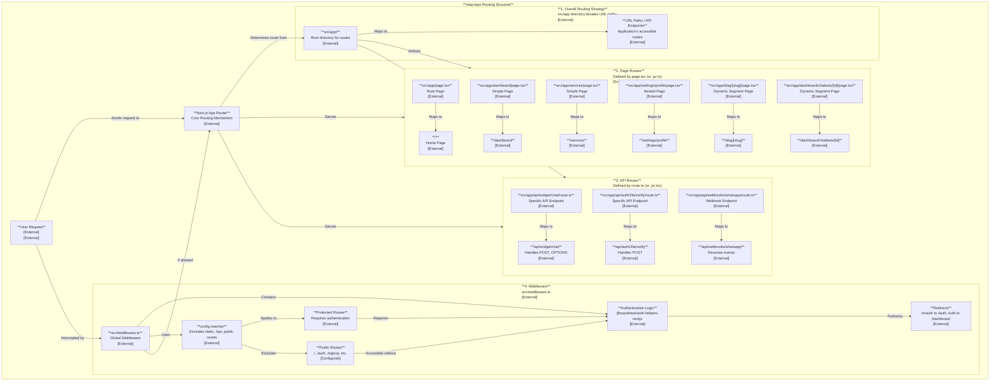

# Unnamed CodeViz Diagram

```mermaid
graph TD

    subgraph adf9b17d-IntajRepoRouting["**intaj-repo Routing Structure**<br>Next.js App Router (File-system based)<br>[External]"]
        adf9b17d-NXR["**Next.js App Router**<br>Core Routing Mechanism<br>[External]"]
        adf9b17d-U1["**User Request**<br>[External]<br>[External]"]
        subgraph adf9b17d-ApiRoutes["**3. API Routes**<br>Defined by route.ts (or .js/.tsx)<br>[External]"]
            adf9b17d-A_AUTH["**src/app/api/auth/2fa/verify/route.ts**<br>Specific API Endpoint<br>[External]"]
            adf9b17d-A_WEBHOOK["**src/app/api/webhooks/whatsapp/route.ts**<br>Webhook Endpoint<br>[External]"]
            adf9b17d-A_WIDGET["**src/app/api/widget/chat/route.ts**<br>Specific API Endpoint<br>[External]"]
            adf9b17d-API_AUTH["**/api/auth/2fa/verify**<br>Handles POST<br>[External]"]
            adf9b17d-API_WEBHOOK["**/api/webhooks/whatsapp**<br>Receives events<br>[External]"]
            adf9b17d-API_WIDGET["**/api/widget/chat**<br>Handles POST, OPTIONS<br>[External]"]
            %% Edges at this level (grouped by source)
            adf9b17d-A_WIDGET["**src/app/api/widget/chat/route.ts**<br>Specific API Endpoint<br>[External]"] -->|"Maps to"| adf9b17d-API_WIDGET["**/api/widget/chat**<br>Handles POST, OPTIONS<br>[External]"]
            adf9b17d-A_AUTH["**src/app/api/auth/2fa/verify/route.ts**<br>Specific API Endpoint<br>[External]"] -->|"Maps to"| adf9b17d-API_AUTH["**/api/auth/2fa/verify**<br>Handles POST<br>[External]"]
            adf9b17d-A_WEBHOOK["**src/app/api/webhooks/whatsapp/route.ts**<br>Webhook Endpoint<br>[External]"] -->|"Maps to"| adf9b17d-API_WEBHOOK["**/api/webhooks/whatsapp**<br>Receives events<br>[External]"]
        end
        subgraph adf9b17d-Middleware["**4. Middleware**<br>src/middleware.ts<br>[External]"]
            adf9b17d-M_AUTH["**Authentication Logic**<br>@supabase/auth-helpers-nextjs<br>[External]"]
            adf9b17d-M_FILE["**src/middleware.ts**<br>Global Middleware<br>[External]"]
            adf9b17d-M_MATCHER["**config.matcher**<br>Excludes static, /api, public routes<br>[External]"]
            adf9b17d-M_PROTECTED["**Protected Routes**<br>Requires authentication<br>[External]"]
            adf9b17d-M_PUBLIC["**Public Routes**<br>/, /auth, /signup, etc.<br>[Configured]"]
            adf9b17d-M_REDIRECTS["**Redirects**<br>Unauth to /auth, Auth to /dashboard<br>[External]"]
            %% Edges at this level (grouped by source)
            adf9b17d-M_FILE["**src/middleware.ts**<br>Global Middleware<br>[External]"] -->|"Contains"| adf9b17d-M_AUTH["**Authentication Logic**<br>@supabase/auth-helpers-nextjs<br>[External]"]
            adf9b17d-M_FILE["**src/middleware.ts**<br>Global Middleware<br>[External]"] -->|"Uses"| adf9b17d-M_MATCHER["**config.matcher**<br>Excludes static, /api, public routes<br>[External]"]
            adf9b17d-M_AUTH["**Authentication Logic**<br>@supabase/auth-helpers-nextjs<br>[External]"] -->|"Performs"| adf9b17d-M_REDIRECTS["**Redirects**<br>Unauth to /auth, Auth to /dashboard<br>[External]"]
            adf9b17d-M_MATCHER["**config.matcher**<br>Excludes static, /api, public routes<br>[External]"] -->|"Applies to"| adf9b17d-M_PROTECTED["**Protected Routes**<br>Requires authentication<br>[External]"]
            adf9b17d-M_MATCHER["**config.matcher**<br>Excludes static, /api, public routes<br>[External]"] -->|"Excludes"| adf9b17d-M_PUBLIC["**Public Routes**<br>/, /auth, /signup, etc.<br>[Configured]"]
            adf9b17d-M_PUBLIC["**Public Routes**<br>/, /auth, /signup, etc.<br>[Configured]"] -->|"Accessible without"| adf9b17d-M_AUTH["**Authentication Logic**<br>@supabase/auth-helpers-nextjs<br>[External]"]
            adf9b17d-M_PROTECTED["**Protected Routes**<br>Requires authentication<br>[External]"] -->|"Requires"| adf9b17d-M_AUTH["**Authentication Logic**<br>@supabase/auth-helpers-nextjs<br>[External]"]
        end
        subgraph adf9b17d-OverallStrategy["**1. Overall Routing Strategy**<br>src/app directory dictates URL paths<br>[External]"]
            adf9b17d-SRCAP["**src/app/**<br>Root directory for routes<br>[External]"]
            adf9b17d-URLPATHS["**URL Paths / API Endpoints**<br>Application's accessible routes<br>[External]"]
            %% Edges at this level (grouped by source)
            adf9b17d-SRCAP["**src/app/**<br>Root directory for routes<br>[External]"] -->|"Maps to"| adf9b17d-URLPATHS["**URL Paths / API Endpoints**<br>Application's accessible routes<br>[External]"]
        end
        subgraph adf9b17d-PageRoutes["**2. Page Routes**<br>Defined by page.tsx (or .js/.ts)<br>[External]"]
            adf9b17d-P_DASH["**src/app/dashboard/page.tsx**<br>Simple Page<br>[External]"]
            adf9b17d-P_DYN_BLOG["**src/app/blog/[slug]/page.tsx**<br>Dynamic Segment Page<br>[External]"]
            adf9b17d-P_DYN_CHAT["**src/app/dashboard/chatbots/[id]/page.tsx**<br>Dynamic Segment Page<br>[External]"]
            adf9b17d-P_NEST["**src/app/settings/profile/page.tsx**<br>Nested Page<br>[External]"]
            adf9b17d-P_ROOT["**src/app/page.tsx**<br>Root Page<br>[External]"]
            adf9b17d-P_SERV["**src/app/services/page.tsx**<br>Simple Page<br>[External]"]
            adf9b17d-URL_DASH["**/dashboard**<br>[External]"]
            adf9b17d-URL_DYN_BLOG["**/blog/[slug]**<br>[External]"]
            adf9b17d-URL_DYN_CHAT["**/dashboard/chatbots/[id]**<br>[External]"]
            adf9b17d-URL_NEST["**/settings/profile**<br>[External]"]
            adf9b17d-URL_ROOT["**/**<br>Home Page<br>[External]"]
            adf9b17d-URL_SERV["**/services**<br>[External]"]
            %% Edges at this level (grouped by source)
            adf9b17d-P_ROOT["**src/app/page.tsx**<br>Root Page<br>[External]"] -->|"Maps to"| adf9b17d-URL_ROOT["**/**<br>Home Page<br>[External]"]
            adf9b17d-P_DASH["**src/app/dashboard/page.tsx**<br>Simple Page<br>[External]"] -->|"Maps to"| adf9b17d-URL_DASH["**/dashboard**<br>[External]"]
            adf9b17d-P_SERV["**src/app/services/page.tsx**<br>Simple Page<br>[External]"] -->|"Maps to"| adf9b17d-URL_SERV["**/services**<br>[External]"]
            adf9b17d-P_NEST["**src/app/settings/profile/page.tsx**<br>Nested Page<br>[External]"] -->|"Maps to"| adf9b17d-URL_NEST["**/settings/profile**<br>[External]"]
            adf9b17d-P_DYN_BLOG["**src/app/blog/[slug]/page.tsx**<br>Dynamic Segment Page<br>[External]"] -->|"Maps to"| adf9b17d-URL_DYN_BLOG["**/blog/[slug]**<br>[External]"]
            adf9b17d-P_DYN_CHAT["**src/app/dashboard/chatbots/[id]/page.tsx**<br>Dynamic Segment Page<br>[External]"] -->|"Maps to"| adf9b17d-URL_DYN_CHAT["**/dashboard/chatbots/[id]**<br>[External]"]
        end
        %% Edges at this level (grouped by source)
        adf9b17d-U1["**User Request**<br>[External]<br>[External]"] -->|"Sends request to"| adf9b17d-NXR["**Next.js App Router**<br>Core Routing Mechanism<br>[External]"]
        adf9b17d-U1["**User Request**<br>[External]<br>[External]"] -->|"Intercepted by"| adf9b17d-M_FILE["**src/middleware.ts**<br>Global Middleware<br>[External]"]
        adf9b17d-NXR["**Next.js App Router**<br>Core Routing Mechanism<br>[External]"] -->|"Determines route from"| adf9b17d-SRCAP["**src/app/**<br>Root directory for routes<br>[External]"]
        adf9b17d-NXR["**Next.js App Router**<br>Core Routing Mechanism<br>[External]"] -->|"Serves"| adf9b17d-PageRoutes["**2. Page Routes**<br>Defined by page.tsx (or .js/.ts)<br>[External]"]
        adf9b17d-NXR["**Next.js App Router**<br>Core Routing Mechanism<br>[External]"] -->|"Serves"| adf9b17d-ApiRoutes["**3. API Routes**<br>Defined by route.ts (or .js/.tsx)<br>[External]"]
        adf9b17d-SRCAP["**src/app/**<br>Root directory for routes<br>[External]"] -->|"Defines"| adf9b17d-PageRoutes["**2. Page Routes**<br>Defined by page.tsx (or .js/.ts)<br>[External]"]
        adf9b17d-SRCAP["**src/app/**<br>Root directory for routes<br>[External]"] -->|"Defines"| adf9b17d-ApiRoutes["**3. API Routes**<br>Defined by route.ts (or .js/.tsx)<br>[External]"]
        adf9b17d-M_FILE["**src/middleware.ts**<br>Global Middleware<br>[External]"] -->|"If allowed"| adf9b17d-NXR["**Next.js App Router**<br>Core Routing Mechanism<br>[External]"]
    end

```
---
*Generated by [CodeViz.ai](https://codeviz.ai) on 9/12/2025, 9:17:17 AM*
