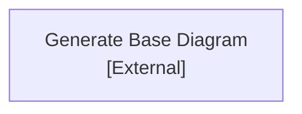

# Unnamed CodeViz Diagram

# Project Routing Structure in `intaj-repo`

```mermaid
graph TD

    subgraph adf9b17d-IntajRepoRouting["**intaj-repo Routing Structure**<br>Next.js App Router (File-system based)<br>[External]"]
        adf9b17d-NXR["**Next.js App Router**<br>Core Routing Mechanism<br>[External]"]
        adf9b17d-U1["**User Request**<br>[External]<br>[External]"]
        subgraph adf9b17d-ApiRoutes["**3. API Routes**<br>Defined by route.ts (or .js/.tsx)<br>[External]"]
            adf9b17d-A_AUTH["**src/app/api/auth/2fa/verify/route.ts**<br>Specific API Endpoint<br>[External]"]
            adf9b17d-A_WEBHOOK["**src/app/api/webhooks/whatsapp/route.ts**<br>Webhook Endpoint<br>[External]"]
            adf9b17d-A_WIDGET["**src/app/api/widget/chat/route.ts**<br>Specific API Endpoint<br>[External]"]
            adf9b17d-API_AUTH["**/api/auth/2fa/verify**<br>Handles POST<br>[External]"]
            adf9b17d-API_WEBHOOK["**/api/webhooks/whatsapp**<br>Receives events<br>[External]"]
            adf9b17d-API_WIDGET["**/api/widget/chat**<br>Handles POST, OPTIONS<br>[External]"]
            %% Edges at this level (grouped by source)
            adf9b17d-A_WIDGET["**src/app/api/widget/chat/route.ts**<br>Specific API Endpoint<br>[External]"] -->|"Maps to"| adf9b17d-API_WIDGET["**/api/widget/chat**<br>Handles POST, OPTIONS<br>[External]"]
            adf9b17d-A_AUTH["**src/app/api/auth/2fa/verify/route.ts**<br>Specific API Endpoint<br>[External]"] -->|"Maps to"| adf9b17d-API_AUTH["**/api/auth/2fa/verify**<br>Handles POST<br>[External]"]
            adf9b17d-A_WEBHOOK["**src/app/api/webhooks/whatsapp/route.ts**<br>Webhook Endpoint<br>[External]"] -->|"Maps to"| adf9b17d-API_WEBHOOK["**/api/webhooks/whatsapp**<br>Receives events<br>[External]"]
        end
        subgraph adf9b17d-Middleware["**4. Middleware**<br>src/middleware.ts<br>[External]"]
            adf9b17d-M_AUTH["**Authentication Logic**<br>@supabase/auth-helpers-nextjs<br>[External]"]
            adf9b17d-M_FILE["**src/middleware.ts**<br>Global Middleware<br>[External]"]
            adf9b17d-M_MATCHER["**config.matcher**<br>Excludes static, /api, public routes<br>[External]"]
            adf9b17d-M_PROTECTED["**Protected Routes**<br>Requires authentication<br>[External]"]
            adf9b17d-M_PUBLIC["**Public Routes**<br>/, /auth, /signup, etc.<br>[Configured]"]
            adf9b17d-M_REDIRECTS["**Redirects**<br>Unauth to /auth, Auth to /dashboard<br>[External]"]
            %% Edges at this level (grouped by source)
            adf9b17d-M_FILE["**src/middleware.ts**<br>Global Middleware<br>[External]"] -->|"Contains"| adf9b17d-M_AUTH["**Authentication Logic**<br>@supabase/auth-helpers-nextjs<br>[External]"]
            adf9b17d-M_FILE["**src/middleware.ts**<br>Global Middleware<br>[External]"] -->|"Uses"| adf9b17d-M_MATCHER["**config.matcher**<br>Excludes static, /api, public routes<br>[External]"]
            adf9b17d-M_AUTH["**Authentication Logic**<br>@supabase/auth-helpers-nextjs<br>[External]"] -->|"Performs"| adf9b17d-M_REDIRECTS["**Redirects**<br>Unauth to /auth, Auth to /dashboard<br>[External]"]
            adf9b17d-M_MATCHER["**config.matcher**<br>Excludes static, /api, public routes<br>[External]"] -->|"Applies to"| adf9b17d-M_PROTECTED["**Protected Routes**<br>Requires authentication<br>[External]"]
            adf9b17d-M_MATCHER["**config.matcher**<br>Excludes static, /api, public routes<br>[External]"] -->|"Excludes"| adf9b17d-M_PUBLIC["**Public Routes**<br>/, /auth, /signup, etc.<br>[Configured]"]
            adf9b17d-M_PUBLIC["**Public Routes**<br>/, /auth, /signup, etc.<br>[Configured]"] -->|"Accessible without"| adf9b17d-M_AUTH["**Authentication Logic**<br>@supabase/auth-helpers-nextjs<br>[External]"]
            adf9b17d-M_PROTECTED["**Protected Routes**<br>Requires authentication<br>[External]"] -->|"Requires"| adf9b17d-M_AUTH["**Authentication Logic**<br>@supabase/auth-helpers-nextjs<br>[External]"]
        end
        subgraph adf9b17d-OverallStrategy["**1. Overall Routing Strategy**<br>src/app directory dictates URL paths<br>[External]"]
            adf9b17d-SRCAP["**src/app/**<br>Root directory for routes<br>[External]"]
            adf9b17d-URLPATHS["**URL Paths / API Endpoints**<br>Application's accessible routes<br>[External]"]
            %% Edges at this level (grouped by source)
            adf9b17d-SRCAP["**src/app/**<br>Root directory for routes<br>[External]"] -->|"Maps to"| adf9b17d-URLPATHS["**URL Paths / API Endpoints**<br>Application's accessible routes<br>[External]"]
        end
        subgraph adf9b17d-PageRoutes["**2. Page Routes**<br>Defined by page.tsx (or .js/.ts)<br>[External]"]
            adf9b17d-P_DASH["**src/app/dashboard/page.tsx**<br>Simple Page<br>[External]"]
            adf9b17d-P_DYN_BLOG["**src/app/blog/[slug]/page.tsx**<br>Dynamic Segment Page<br>[External]"]
            adf9b17d-P_DYN_CHAT["**src/app/dashboard/chatbots/[id]/page.tsx**<br>Dynamic Segment Page<br>[External]"]
            adf9b17d-P_NEST["**src/app/settings/profile/page.tsx**<br>Nested Page<br>[External]"]
            adf9b17d-P_ROOT["**src/app/page.tsx**<br>Root Page<br>[External]"]
            adf9b17d-P_SERV["**src/app/services/page.tsx**<br>Simple Page<br>[External]"]
            adf9b17d-URL_DASH["**/dashboard**<br>[External]"]
            adf9b17d-URL_DYN_BLOG["**/blog/[slug]**<br>[External]"]
            adf9b17d-URL_DYN_CHAT["**/dashboard/chatbots/[id]**<br>[External]"]
            adf9b17d-URL_NEST["**/settings/profile**<br>[External]"]
            adf9b17d-URL_ROOT["**/**<br>Home Page<br>[External]"]
            adf9b17d-URL_SERV["**/services**<br>[External]"]
            %% Edges at this level (grouped by source)
            adf9b17d-P_ROOT["**src/app/page.tsx**<br>Root Page<br>[External]"] -->|"Maps to"| adf9b17d-URL_ROOT["**/**<br>Home Page<br>[External]"]
            adf9b17d-P_DASH["**src/app/dashboard/page.tsx**<br>Simple Page<br>[External]"] -->|"Maps to"| adf9b17d-URL_DASH["**/dashboard**<br>[External]"]
            adf9b17d-P_SERV["**src/app/services/page.tsx**<br>Simple Page<br>[External]"] -->|"Maps to"| adf9b17d-URL_SERV["**/services**<br>[External]"]
            adf9b17d-P_NEST["**src/app/settings/profile/page.tsx**<br>Nested Page<br>[External]"] -->|"Maps to"| adf9b17d-URL_NEST["**/settings/profile**<br>[External]"]
            adf9b17d-P_DYN_BLOG["**src/app/blog/[slug]/page.tsx**<br>Dynamic Segment Page<br>[External]"] -->|"Maps to"| adf9b17d-URL_DYN_BLOG["**/blog/[slug]**<br>[External]"]
            adf9b17d-P_DYN_CHAT["**src/app/dashboard/chatbots/[id]/page.tsx**<br>Dynamic Segment Page<br>[External]"] -->|"Maps to"| adf9b17d-URL_DYN_CHAT["**/dashboard/chatbots/[id]**<br>[External]"]
        end
        %% Edges at this level (grouped by source)
        adf9b17d-U1["**User Request**<br>[External]<br>[External]"] -->|"Sends request to"| adf9b17d-NXR["**Next.js App Router**<br>Core Routing Mechanism<br>[External]"]
        adf9b17d-U1["**User Request**<br>[External]<br>[External]"] -->|"Intercepted by"| adf9b17d-M_FILE["**src/middleware.ts**<br>Global Middleware<br>[External]"]
        adf9b17d-NXR["**Next.js App Router**<br>Core Routing Mechanism<br>[External]"] -->|"Determines route from"| adf9b17d-SRCAP["**src/app/**<br>Root directory for routes<br>[External]"]
        adf9b17d-NXR["**Next.js App Router**<br>Core Routing Mechanism<br>[External]"] -->|"Serves"| adf9b17d-PageRoutes["**2. Page Routes**<br>Defined by page.tsx (or .js/.ts)<br>[External]"]
        adf9b17d-NXR["**Next.js App Router**<br>Core Routing Mechanism<br>[External]"] -->|"Serves"| adf9b17d-ApiRoutes["**3. API Routes**<br>Defined by route.ts (or .js/.tsx)<br>[External]"]
        adf9b17d-SRCAP["**src/app/**<br>Root directory for routes<br>[External]"] -->|"Defines"| adf9b17d-PageRoutes["**2. Page Routes**<br>Defined by page.tsx (or .js/.ts)<br>[External]"]
        adf9b17d-SRCAP["**src/app/**<br>Root directory for routes<br>[External]"] -->|"Defines"| adf9b17d-ApiRoutes["**3. API Routes**<br>Defined by route.ts (or .js/.tsx)<br>[External]"]
        adf9b17d-M_FILE["**src/middleware.ts**<br>Global Middleware<br>[External]"] -->|"If allowed"| adf9b17d-NXR["**Next.js App Router**<br>Core Routing Mechanism<br>[External]"]
    end

```

The `intaj-repo` project leverages the **Next.js App Router** for its routing system, which is primarily file-system based. This means that the directory and file structure within the `src/app` directory directly dictate the application's URL paths and API endpoints.

## 1. Overall Routing Strategy

The core principle is that each folder within `src/app` represents a segment of a URL path. The presence of specific files within these folders then defines whether it's a user-facing page or an API endpoint.

## 2. Page Routes (`src/app/**/page.{ts,tsx,js}`)

User-facing pages are defined by `page.tsx` (or `.js`/`.ts`) files. The path to this file, relative to `src/app`, forms the URL.

-   **Root Page:** `src/app/page.tsx` maps to the application's home page: `/`
-   **Simple Pages:**
    -   `src/app/dashboard/page.tsx` maps to `/dashboard`
    -   `src/app/services/page.tsx` maps to `/services`
-   **Nested Pages (Example:&#32;`/y/x`&#32;pattern):**
    -   If there were a file `src/app/settings/profile/page.tsx`, it would map to `/settings/profile`.
-   **Dynamic Segments:** Square brackets `[]` are used to define dynamic parts of the URL. The value within the brackets becomes a parameter accessible in the page component.
    -   `src/app/blog/[slug]/page.tsx` maps to `/blog/my-first-post`, `/blog/another-article`, etc. (`slug` is the dynamic parameter).
    -   `src/app/dashboard/chatbots/[id]/page.tsx` maps to `/dashboard/chatbots/123`, `/dashboard/chatbots/abc`, etc. (`id` is the dynamic parameter).

## 3. API Routes (`src/app/**/route.{ts,tsx,js}`)

API endpoints are defined by `route.ts` (or `.js`/`.tsx`) files. Similar to page routes, their URL path is determined by their location within `src/app`, typically under an `api` subdirectory.

-   **Specific API Endpoints:** These files export HTTP method handlers (e.g., `GET`, `POST`, `PUT`, `DELETE`).
    -   `src/app/api/widget/chat/route.ts` maps to `/api/widget/chat`. This file would contain `POST` and `OPTIONS` handlers for chat functionality.
    -   `src/app/api/auth/2fa/verify/route.ts` maps to `/api/auth/2fa/verify`, likely handling `POST` requests for 2FA verification.
-   **Webhook Endpoints:**
    -   `src/app/api/webhooks/whatsapp/route.ts` maps to `/api/webhooks/whatsapp`, designed to receive incoming WhatsApp webhook events.

## 4. Middleware (`src/middleware.ts`)

The `src/middleware.ts` file defines a global middleware that runs before requests are completed. It's crucial for implementing cross-cutting concerns like authentication and redirects.

-   **Authentication Logic:** It uses `@supabase/auth-helpers-nextjs` to manage user sessions.
    -   It redirects unauthenticated users from protected routes to `/auth`.
    -   It redirects authenticated users trying to access `/auth` to `/dashboard`.
-   **Route Matching:** The middleware is configured with a `config.matcher` to apply to almost all routes, explicitly excluding static assets (`_next/static`, `_next/image`), `favicon.ico`, files in the `public` directory, and all API routes (`/api`).
-   **Public Routes:** Explicitly defined public routes (e.g., `/`, `/auth`, `/signup`, `/about-us`, `/features`, `/pricing`, `/services`, `/contact-us`, `/policy`) are accessible without authentication.

## 5. Nested Routes and Modular Structure

The file-system routing inherently supports nested routes. Any subdirectory within a route folder creates a deeper path segment. For example, `src/app/dashboard/settings/page.tsx` would create the route `/dashboard/settings`.

This structure naturally leads to a modular organization:

-   `src/app/api` acts as a dedicated module for all backend API endpoints.
-   Directories like `src/app/dashboard`, `src/app/chatbots`, `src/app/auth`, etc., function as distinct modules, encapsulating their specific routes, pages, and components for different parts of the application's functionality.

In summary, the `intaj-repo` project's routing is highly organized and intuitive, relying on Next.js's file-system conventions to map application structure directly to URL paths, supported by a global middleware for security and flow control.

---
*Generated by [CodeViz.ai](https://codeviz.ai) on 9/12/2025, 9:35:28 AM*
